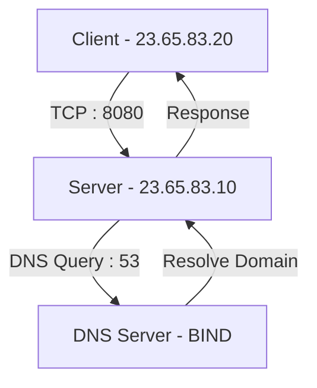

<div align="center">

# 🌐 DNS & Client-Server System

### 🚀 Advanced Linux Networking Project


<br/>


<br/>


</div>

---

## 🧠 Project Overview

> A **real-world networking system simulation** combining DNS, Mail Servers, and Socket Programming.

✨ Fully functional **Authoritative DNS Server (BIND)**
✨ Forward & Reverse DNS resolution
✨ TCP Client-Server system using **C sockets**
✨ Mail server setup with **Postfix + Dovecot**
✨ Real-time connection logging system

---

## 🧩 System Architecture (Visual)

<div align="center">



</div>

---

## 🌐 DNS Configuration

### 🔹 Forward DNS

```bash
IT23658318.lk        → 23.65.83.10
Lithira8318          → 23.65.83.10
Lithira8318cli       → 23.65.83.20
```

### 🔹 Reverse DNS

```bash
23.65.83.10 → Lithira8318.IT23658318.lk
23.65.83.20 → Lithira8318cli.IT23658318.lk
```

---

## 💻 Client-Server Module

### ⚡ Key Features

✔ High-performance TCP socket communication
✔ Iterative server architecture
✔ Real-time date & time response
✔ Client IP + Port logging
✔ Multi-client handling support

---

## 📧 Mail Server Setup

### 🔹 Stack

* **Postfix** → Sending Emails (MTA)
* **Dovecot** → Receiving Emails (MDA)

### 🔹 Features

✔ Maildir storage system
✔ Local mail delivery
✔ DNS MX record integration

---

## ⚙️ Tech Stack

| Layer       | Technology        |
| ----------- | ----------------- |
| OS          | Linux (CentOS)    |
| DNS         | BIND (named)      |
| Language    | C                 |
| Networking  | TCP/IP            |
| Mail Server | Postfix + Dovecot |

---

## 🚀 How to Run

### 🔧 Compile

```bash
gcc server.c -o server
gcc client.c -o client
```

### ▶️ Start Server

```bash
./server
```

### ▶️ Start Client

```bash
./client
```

---

## 🧪 DNS Testing Commands

```bash
dig @23.65.83.10 IT23658318.lk
dig Lithira8318.IT23658318.lk
dig -x 23.65.83.10
```

---

## 📊 Project Highlights

<div align="center">

🔥 Real-world DNS Implementation
🔥 Full Networking Flow Simulation
🔥 System-level Programming (C)
🔥 Linux Server Configuration

</div>

---

## 🎯 Learning Outcomes

✔ DNS Zone File Configuration
✔ Socket Programming (TCP)
✔ Linux Networking
✔ Server Deployment & Debugging

---

## 👨‍💻 Author

<div align="center">

### **Lithira Liyanage**

🎓 IT Undergraduate
💡 Passionate about Networking & Systems

</div>

---

## ⭐ Support

If you found this project useful:

👉 Give this repo a ⭐
👉 Share with your friends

---

<div align="center">

🚀 *“Turning Networking Concepts into Real Systems”*

</div>

